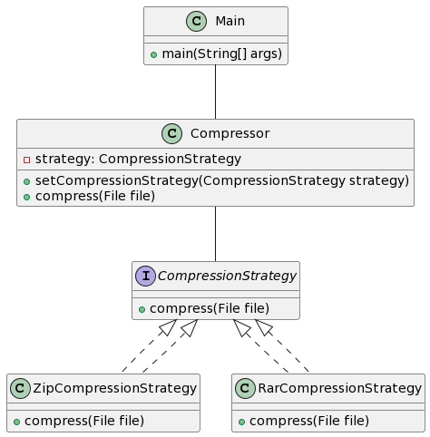
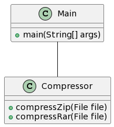

# Con Strategy

En este ejemplo, hemos creado una interface de CompressionStrategy que define el método "compress" para comprimir un archivo. Luego, hemos creado dos clases concretas que implementan esta interface: ZipCompressionStrategy y RarCompressionStrategy. Cada una de estas clases implementa el método "compress" utilizando un algoritmo de compresión diferente.

Finalmente, hemos creado la clase Compressor que tiene una variable de instancia de tipo CompressionStrategy y un método "setCompressionStrategy" para establecer la estrategia de compresión a utilizar. La clase Compressor también tiene un método "compress" que utiliza la estrategia de compresión establecida para comprimir un archivo.

En el método main, podemos crear un objeto de la clase Compressor y usar los métodos "setCompressionStrategy" y "compress" para comprimir un archivo utilizando diferentes algoritmos de compresión. En este caso, estamos comprimiendo el archivo "file.txt" utilizando primero el algoritmo ZIP y luego el algoritmo RAR.

La ventaja de usar el patrón de diseño Strategy en este caso es que permite a la clase Compressor cambiar su comportamiento en tiempo de ejecución según la estrategia de compresión que se le asigne. Esto hace que la clase Compressor sea más versátil y reutilizable, ya que puede utilizar diferentes algoritmos de compresión sin tener que conocer los detalles de cómo se implementan esos algoritmos.

Además, al separar la lógica de compresión de diferentes algoritmos en clases separadas, podemos agregar nuevos algoritmos de compresión de manera más sencilla y mantenible. En lugar de tener que modificar la clase Compressor para agregar un nuevo algoritmo de compresión, simplemente podemos crear una nueva clase que implemente la interface CompressionStrategy y utilizar esa clase como una nueva estrategia de compresión.


     

En este diagrama, la interface CompressionStrategy representa la estrategia de compresión a utilizar. Las clases ZipCompressionStrategy y RarCompressionStrategy son clases concretas que implementan esta interface y que utilizan diferentes algoritmos de compresión.

La clase Compressor es la clase que utiliza la estrategia de compresión para comprimir un archivo. Tiene una variable de instancia de tipo CompressionStrategy y un método "setCompressionStrategy" para establecer la estrategia de compresión a utilizar. La clase Compressor también tiene un método "compress" que utiliza la estrategia de compresión establecida para comprimir un archivo.

Por último, la clase Main es la clase principal que crea un objeto de la clase Compressor y usa los métodos "setCompressionStrategy" y "compress" para comprimir un archivo utilizando diferentes algoritmos de compresión
# Sin Strategy

En este ejemplo, hemos creado la clase Compressor con dos métodos "compressZip" y "compressRar" para comprimir un archivo utilizando los algoritmos ZIP y RAR respectivamente.

Si quisiéramos agregar más algoritmos de compresión, tendríamos que agregar más métodos a la clase Compressor para cada uno de ellos. Esto puede hacer que la clase Compressor se vuelva muy grande y difícil de mantener a medida que se agreguen más algoritmos de compresión.

Para evitar este problema, podríamos usar el patrón de diseño Strategy para separar la lógica de compresión de diferentes algoritmos en clases separadas y permitir que la clase Compressor cambie su comportamiento en tiempo de ejecución según la estrategia que se le asigne. Esto nos permitiría agregar nuevos algoritmos de compresión de manera más sencilla y mantenible.




En este caso, la clase Compressor tiene dos métodos "compressZip" y "compressRar" para comprimir un archivo utilizando los algoritmos ZIP y RAR respectivamente. La clase Main es la clase principal que crea un objeto de la clase Compressor y usa estos métodos para comprimir un archivo utilizando diferentes algoritmos de compresión.

Como puedes ver, en este caso no hay una interface de CompressionStrategy ni clases concretas que implementen esa interface. Todo el código necesario para comprimir un archivo utilizando diferentes algoritmos está contenido en la clase Compressor. Esto puede hacer que la clase Compressor sea más grande y difícil de mantener a medida que se agreguen más algoritmos de compresión.

# Ejercicio: Sistema de pago en línea

Se necesita implementar un sistema de pago en línea que permita a los usuarios realizar pagos utilizando diferentes métodos de pago, como tarjeta de crédito, débito o PayPal.

Se te ha proporcionado la siguiente interface de PaymentMethod:

```java
interface PaymentMethod {
  public void pay(double amount);
}
```

Esta interface tiene un método "pay" que recibe el monto a pagar y realiza el pago utilizando el método de pago correspondiente.

Tu tarea es implementar las siguientes clases:

CreditCardPayment: clase que implementa la interface PaymentMethod y que realiza un pago utilizando una tarjeta de crédito.
DebitCardPayment: clase que implementa la interface PaymentMethod y que realiza un pago utilizando una tarjeta de débito.
PayPalPayment: clase que implementa la interface PaymentMethod y que realiza un pago utilizando PayPal.
Luego, debes crear una clase PaymentSystem que tenga una variable de instancia de tipo PaymentMethod y un método "setPaymentMethod" para establecer el método de pago a utilizar. La clase PaymentSystem también debe tener un método "pay" que utilice el método de pago establecido para realizar el pago.

Finalmente, debes crear una clase Main que cree un objeto de la clase PaymentSystem y use los métodos "setPaymentMethod" y "pay" para realizar un pago utilizando diferentes métodos de pago.

Por ejemplo, si quisiéramos realizar un pago de 100 euros utilizando una tarjeta de crédito, podríamos hacerlo de la siguiente manera:

```java
PaymentSystem paymentSystem = new PaymentSystem();
paymentSystem.setPaymentMethod(new CreditCardPayment());
paymentSystem.pay(100);
```
Al resolver este ejercicio, debes aplicar el patrón de diseño Strategy para separar la lógica de pago de diferentes métodos de pago en clases separadas y permitir que la clase PaymentSystem cambie su comportamiento en tiempo de ejecución según el método de pago que se le asigne. De esta manera, podrás agregar nuevos métodos de pago de manera más sencilla y mantenible.


